# Strava-Cycling-Modeling-for-Dublin

## The Author

[Chris Luo](https://chrislu0.wordpress.com/), Data Analyst, Smart Dublin, Dublin City Council

## Introduction

Planning for cycling infrastructure can be challenging due to the lack of detailed information on where and when people are biking. However, with the rise of crowdsourced data from platforms like Strava, cities now have the opportunity to gain insights beyond what traditional bike counters, such as the Eco-Counts used in Dublin, can provide.

Nevertheless, crowdsourced data doesn't fully represent the entire cycling population, which means there's still much we don't know about cycling trips. Without this knowledge, planning for cycling infrastructure can feel like working with one hand tied behind your back.

My project aims to fill this gap by comparing several years of Strava data with manual counts of cyclists in the context of Dublin.  The method is to find the relationship between existing cyclecounters and Strava Metro data (while controlling for other factors), then generalise the relationship to all Strava Metro data.​ This is the first practice of its kind to analyze Dublin cycling trips in this way. 

After running a multiple regression model, the results show a strong correlation between Strava data and cycle counts in Dublin. The model validation shows an overall 87% of predictiion accuracy. This indicates that Strava can be a good predictor of actual cycling figures at the route-specific level.

In this document, I will introduce the modelling process, data sources, results and validation.

## Strava Metro

Strava is an American app for tracking physical exercise, primarily focusing on outdoor cycling and running activities using GPS data. As of 2023, Strava has 120 million registered users worldwide, according to [Business of Apps](https://www.businessofapps.com/data/strava-statistics/).

[Strava Metro](https://metro.strava.com/) is Strava's official data platform. It contains downloadable anonymized Strava user geo-referenced and time-stamped activity data (including cycling, running, and walking). The data from the platform provides excellent granularity, offering high-resolution time dimensions that can be as specific as hours and covering almost every street in Dublin.

Strava Metro serves as a great example of how companies can present user-generated data on an open and intuitive platform, enabling researchers and decision-makers to access large amounts of high-quality activity data for valuable use cases.

## The Model and Data

To gain insights into where and when people are biking, one approach is to install more cycle counters on streets of interest in Dublin. However, this method presents several challenges: (1) it is too costly if a large amount of information is required, and (2) it can be difficult to find available and safe locations for additional cycle counters in the city center. So, is there another way to estimate the exact number of cyclists?

An important observation might answer this question. The observation is the high correlation between Strava data and cycle count data captured by cycle counters installed in Dublin. For example, below is a time-series line chart that compares both datasets for Seapoint, Dublin:

### Chart 1: Cycle Counter vs. Strava Trip Counts Over Time in Seapoint (2020-2023, Weekly Summed)

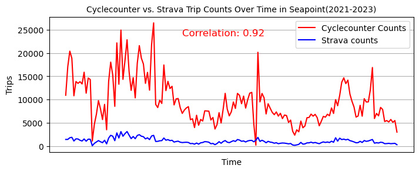

The graph shows a high correlation between the two datasets (0.92) for Seapoint. It also shows that the Strava data reflects the overall trends and seasonal changes of the ground truth value. Although Strava data represents only a subset of the total cyclists at this location, it's possible to use Strava data to estimate cycle counts based on their correlation.

By plotting all the cycle counter data with Strava data, the correlation is also evident:

### Chart 2: Cycle Counter vs. Strava Trip Counts (2020-2023, Weekly Summed)

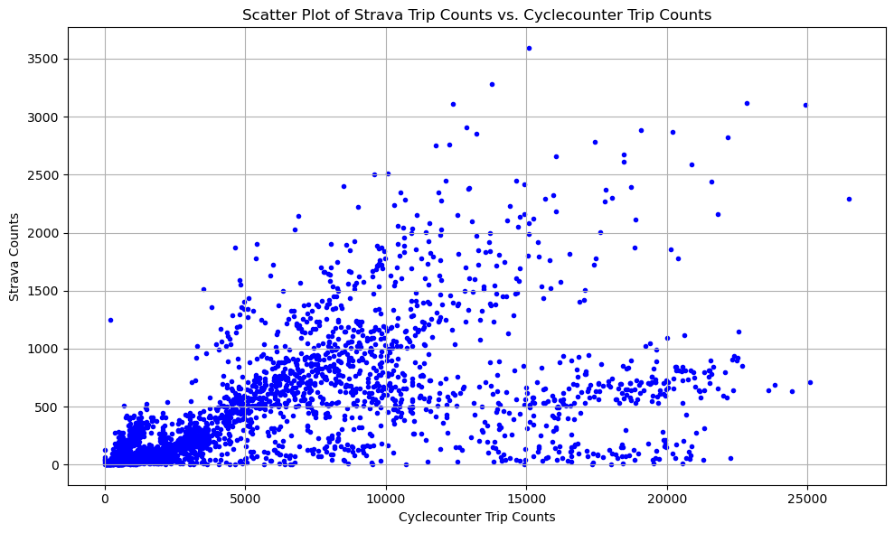

The core question to answer then becomes: **To what extent does Strava cycling trip count data represent the whole cycling population in Dublin?**

To answer this question, we developed a regression model that connects Strava cycling counts and actual cycle counts. After obtaining the relationship, we can then use it as a multiplier to extrapolate the actual cycling trips based on the widely available and highly granular Strava data.

Thus, we set the main independent variable as Strava cycling trip counts (`strava_count`) and the dependent variable of interest as the ground truth cycle counts (`cycle_counts`), which are the target values to match.

Cycle count data is sourced from data generated by cycle counters (EcoCounters) at various locations in Dublin. The data is available on [Dublinked](https://data.smartdublin.ie/dataset/?q=Cycle+count).

Strava cycling trip counts are downloaded from Strava Metro and matched with cycle counter locations.

From Chart 2, we can also see that, despite the correlation, the variance is large as the plots become more scattered as the values increase (in the upper part of both axes), indicating impacts from other factors that relate to Strava data's representation of the whole cycling population since these factors can influence cycling behaviors. Therefore, the model includes additional factors as control variables to account for these influences. Below is a list of variables and their data sources:

### Table A: List of Control Variables

| Variable                         | Description                                                       |
|----------------------------------|-------------------------------------------------------------------|
| `rain`                 | Rainfall, sourced from [Met.ie](https://www.met.ie/)                                      |
| Regions: `Regions_N`,`Region_NE`,`Region_SW`  | Geolocation of the point of interest: North, Northeast, Southwest |
| Months: `month_2`,`month_3`...,`month_12`                  | Months: January to December                                       |
| `CityCenter`             | Whether the location is in the city center (defined by the canal)  |
| `Bike_Lanes`             | Whether the location has bike lane availability - by manul observation from Google Map                  |

The model is a multiple linear regression model using Ordinary Least Squares (OLS) estimator.

The model is given by:

$$
\text{cycle\\_counts} = \beta\_0 + \beta\_1 \cdot \text{strava\\_counts} + \beta\_i \cdot \text{controls} + \varepsilon
$$

Where:
- $\text{cycle\\_counts}$ is the dependent variable, the ground truth cycle count data.
- $\beta\_0$ is the intercept.
- $\beta\_i$ are the coefficients for each independent variable.
- $\text{controls}$ are the control variables, which include the variables in **Table A**.
- $\text{strava\\_counts}$ are the independent variables, the trip counts from Strava.
- $\varepsilon$ is the error term.

The descriptive statistics in Table B summarize the data across three key variables: Actual cycle counts (`cycle_counts`), Strava cycle counts (`strava_counts`), and rainfall (`rain`). All the data are weekly aggregated. The dataset has 2,657 observations, which is the number of observations after removing missing values. The average actual cycle count is 5,450 with a high standard deviation of 5,303.81, indicating significant variability. The Strava cycle count has a mean of 439.16 and an even higher standard deviation of 547.53, showing a broad range of Strava activity levels across different times and locations. The weekly rainfall average is 13.87 mm.

### Table B: Descriptive Statistics

|               | `cycle_counts` | `strava_counts` | `rain`       | `Bike_Lanes` |
|---------------|--------------|---------------|------------|------------|
| count         | 2650.000000  | 2650.000000   | 2650.000000| 2650.000000|
| mean          | 5440.266119  | 439.569811    | 13.903321  | 0.971321   |
| std           | 5297.740803  | 547.637901    | 15.153541  | 0.166935   |
| min           | 1.000000     | 5.000000      | 0.000000   | 0.000000   |
| 25%           | 1053.250000  | 55.000000     | 2.100000   | 1.000000   |
| 50%           | 3449.000000  | 190.000000    | 8.300000   | 1.000000   |
| 75%           | 8452.250000  | 655.000000    | 19.200000  | 1.000000   |
| max           | 26468.000000 | 3590.000000   | 73.400000  | 1.000000   |

The figure below visualizes the locations of existing cycle counters in Dublin. The map highlights that all cycle counters are located within DCC and DLR, with the majority of them positioned outside the city center, indicating a bias in the representation of locations in the sample data.

### Figure 1: Location of Existing Cycle Counters

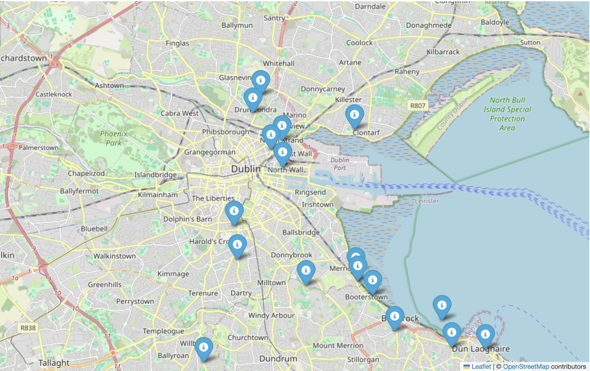

## Results and Model Performance

After running the Ordinary Least Squares(OLS) regression in Python, the results are summarized below:

### Table C: OLS Regression Results

| **Dependent Variable:** | `cycle_count`                        | **R-squared:** | 0.823      |
|-------------------------|------------------------------|----------------|------------|
| **Model:**              | OLS                          | **Adj. R-squared:** | 0.821 |
| **Method:**             | Least Squares                | **F-statistic:** | 724.5 |
| **Prob (F-statistic):** | 0.00                        | **No. Observations:**   | 2831 |
                        

| **Variable**     | **Coefficient** | **Std. Error** | **t-Statistic** | **P-value** | **[0.025** | **0.975]** |
|------------------|-----------------|---------------|-----------------|-------------|------------|-------------|
| **constant**            | -3288.1063      | 353.126       | -9.311          | 0.000       | -3980.518  | -2595.694   |
| `strava_count` | 6.0211          | 0.096         | 62.808          | 0.000       | 5.833      | 6.209       |
| `rain`             | -13.6096        | 3.112         | -4.373          | 0.000       | -19.712    | -7.508      |
| `CityCenter`          | 1.27e+04        | 165.826       | 76.596          | 0.000       | 1.24e+04   | 1.3e+04     |
| `Region_N`           | 913.9911        | 199.195       | 4.588           | 0.000       | 523.408    | 1304.574    |
| `Region_SE`          | -55.6066        | 115.086       | -0.483          | 0.629       | -281.268   | 170.055     |
| `Region_NE`          | -195.0074       | 212.316       | -0.918          | 0.358       | -611.318   | 221.303     |
| `Bike_Lanes`       | 3981.4436       | 311.068       | 12.799          | 0.000       | 3371.498   | 4591.389    |
| `month_2`          | 943.6973        | 225.373       | 4.187           | 0.000       | 501.785    | 1385.610    |
| `month_3`          | 800.3775        | 220.706       | 3.626           | 0.000       | 367.615    | 1233.140    |
| `month_4`          | 646.7796        | 216.860       | 2.982           | 0.003       | 221.559    | 1072.001    |
| `month_5`          | 963.1984        | 213.275       | 4.516           | 0.000       | 545.008    | 1381.389    |
| `month_6`          | 1565.4265       | 223.054       | 7.018           | 0.000       | 1128.061   | 2002.792    |
| `month_7`         | 1439.4031       | 216.589       | 6.646           | 0.000       | 1014.713   | 1864.093    |
| `month_8`         | 1344.8244       | 216.095       | 6.223           | 0.000       | 921.104    | 1768.545    |
| `month_9`          | 2093.4939       | 219.591       | 9.534           | 0.000       | 1662.918   | 2524.070    |
| `month_10`         | 1828.2734       | 213.059       | 8.581           | 0.000       | 1410.506   | 2246.041    |
| `month_11`         | 1251.7521       | 218.861       | 5.719           | 0.000       | 822.608    | 1680.897    |

#### *Note*
**OLS Accuracy**: 87.05%  
**Validation RMSE**: 2213.0555  
**Test RMSE**: 2123.8221  
**Test MAE**: 1729.3820

For full documentation of the modeling process, see here: (`Strava_Model_Code_0820.ipynb`)

## Data Insights

Overall, the model reaches a R-squared score of 0.823(in a range of 0-1), which is a high score of model fit. 

The regression model results shows that Strava trip counts have a significant and positive relationship with actual cycle counts. Specifically, the coefficient for `strava_counts` is approximately 6.0211, meaning that for each additional Strava trip recorded, the total cycle count increases by roughly 6 trips, holding all other variables constant. This strong correlation indicates that Strava data is a good predictor of overall cycling volumes at the route-specific level in Dublin.

Rainfall(`rain`) negatively affects cycle counts, with a coefficient of -13.6096, which suggests that for each millimeter increase in rainfall, there is a corresponding 14 nubmers decrease in cycling activity. This result aligns with the expectation that adverse weather conditions discourage cycling.

The regional dummy variables also provide insight into how different areas in Dublin affect cycling volumes. For instance, the positive coefficients for `Regions_S` and `Regions_SE` suggest that these areas have higher cycling volumes related to Strava users, while negative coefficients for `Regions_N` and `Regions_NE` suggest lower cycling volumes.

The `CityCenter` variable has a positive coefficient, indicating that being in the city center is associated with higher cycling volumes related to Strava users, likely due to higher population density and more destinations within close proximity.

The coefficients for the summer months (e.g., June, July, August) are significantly larger, indicating higher cycling activity related to Strava during these months. For example, the coefficient for June(`month_6`) is 1565.4265 , showing a substantial increase in cycling trips during this month.

Lastly, the presence of bike lanes (`Bike_Lanes`) significantly increases cycling activity, which underscores the importance of dedicated cycling infrastructure in promoting biking.

## Validation

The model shows excellent accuracy after validation. The model achieved an overall accuracy of 87% in a train/test split exercise. The Validation RMSE (OLS) is 2213.0555, and the Test RMSE (OLS) is 2123.8221. Those figures are quite close, indicating that there are no significant overfitting issues with the model. 

Below is a visualization showing the model's fit. The closer the data points are to the red line, the better the model fit. The chart indicates satisfactory results visually.

### Chart 3: Actual vs. Predicted Values
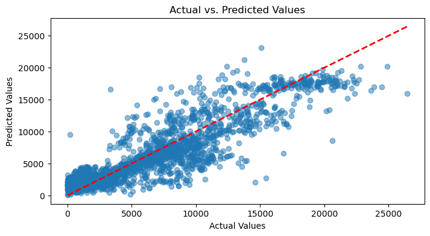

We validated the model's predictions against actual cycling volumes for various locations. For many locations, the model's predictions align well with the actual cycling volumes recorded by cycle counters. For instance:

### Chart 4: Original vs. Predicted Values (Seapoint)
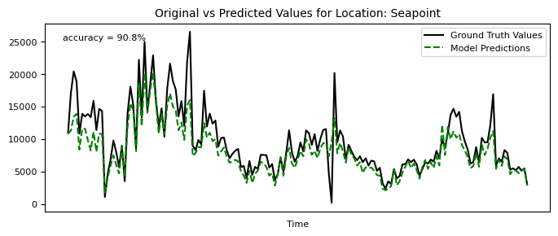

### Chart 5: Original vs. Predicted Values (N11 Inbound)
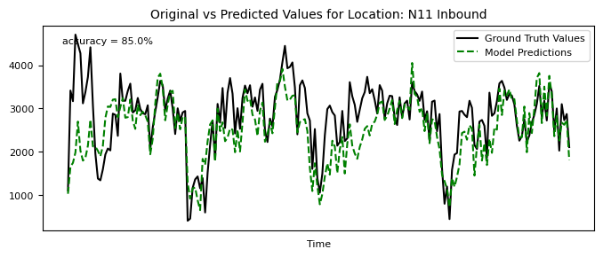

### Chart 6: Original vs. Predicted Values (Richmond)
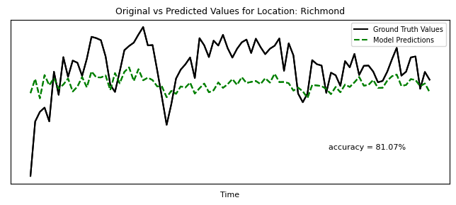

However, the model's accuracy decreased at certain locations. For example, predictions for Clontarf were less accurate:

### Chart 7: Original vs. Predicted Values (Clontarf)
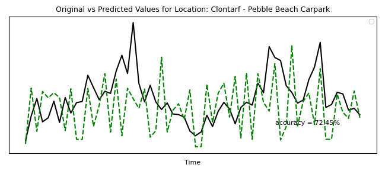

So is Guild Street and Drumcondra.

### Chart 8: Original vs. Predicted Values (Guild)
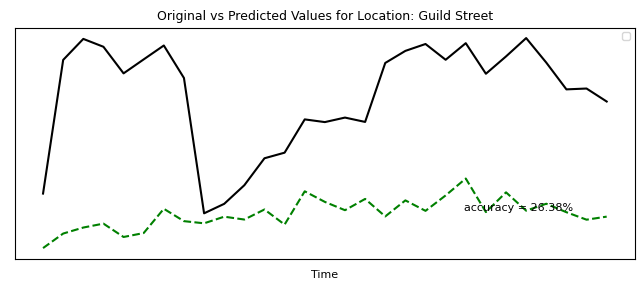

### Chart 9: Original vs. Predicted Values (Drumcondra)
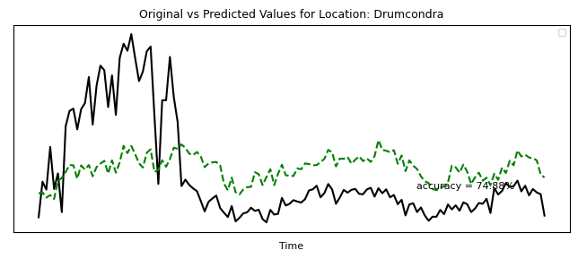

Additionally, in the table below, we validated the model using manual count data for two city center locations—**Amien Street** and **IFSC**, which were not included in the training data. These manual counts were sourced from Dublin City Council's official traffic counts. It also shows below average accuray results for those two central city locations.

### Table E: Validation With Manual Counts (Amien St & IFSC)
| **Time & Location**       | **Strava Count** | **Manual Count** | **Predicted Value** | **Accuracy** |
|---------------------------|------------------|------------------|---------------------|--------------|
| *2024 May 13-19*          |                  |                  |                     |              |
| **Amien St**              | 600              | 14342            | 17971               | 74.70%       |
| **IFSC**                  | 615              | 13126            | 18061              | 62.40%       |

As predicting the number of cyclists at certain locations can be very accurate and others can be inaccurate, we believe the model is best suited for **route-based analysis** since the errors can be weighted out when combining different locations.

### Potential Causes for Inaccuracy
1. **Data Discontinuity Due to Roadworks**: e.g. Drumcondra Cyclists Counter is not on site due to Roadworks since mid-2023.
2. **Potential Sensor Issues**: For example, Castleknock Totem and Coast Road Totem recorded fewer cyclists compared to Strava data due to cycle counter problems. 
3. **Lack of Counters in the City Centre**: This results in lower accuracy in city center areas like Amien Street amd IFSC.

## Use of the Model

To use this model, follow these steps:

1. Prepare Data: Collect and prepare the data, including combined Strava trip counts and control variables.
2. Apply Coefficients: Multiply each variable by its respective model coefficient.
3. Sum Results: Sum the results to estimate the total cycle counts.

Please note this model only applies for Dublin city region as the model is caliborated using Dublin's data.

### Example Calculation

To estimate the cycle counts for a week with the following conditions:

- **Strava trip count**: 100(`strava_count`=100)
- **Rain**: 2 units(`rain`=2)
- **Location**: North(`Region_N`=1)
- **Month**: June(`month_6`=1)
- **Bike Lanes**: Yes (`Bike_Lanes` = 1)

The calculation follows this formula:

$$
\text{Cycle\\_counts} = 
\text{constant} + (\text{Strava\\_count} \times \text{Coefficient}) + (\text{rain} \times \text{Coefficient}) + 
(\text{Region\\_N} \times \text{Coefficient}) + (\text{month\\_6} \times \text{Coefficient}) + 
(\text{Bike\\_Lanes} \times \text{Coefficient})
$$

Substituting the specific coefficients from the model:

$$
\text{Cycle\\_counts} = 
-3288.1063 + (100 \times 6.0211) + (2 \times -13.6096) + 
(913.9911) + (1565.4265) + (1 \times 3981.4436)
$$

$$
\text{Cycle\\_counts} = -3288.1063 + 602.11 - 27.2192 + 913.9911 + 1565.4265 + 3981.4436
$$

$$
\text{Cycle\\_counts} = 3747.6457
$$

So, under these specific conditions, the estimated weekly cycle count is **3748**.

I have also interpolated the cycling trip values for several key cycle routes in Dublin (weekly summed figure) using the Strava data of the whole routes. I have included the raw data in the file [weekly_prediction](`RBA and Validation/weekly prediction.csv`). Below is a quick view of the results:

### Chart 10: Visualisation of Predicted Weekly Cycling Trips for Various Routes:

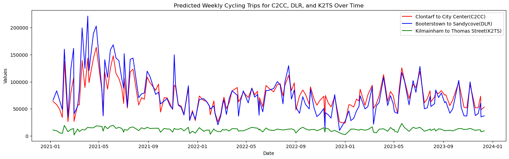

## Future Improvements

Serveral improvements can be done to increase the model accuracy and generalisation ability:
1. Include data from new sensors and corrected sensors. Especially for sensors in the central city.
2. Include manual survey data to enlarge the training dataset(e.g. Canal Cordon Count)
3. Add more independent control variables that might impact strava's correlation to cycling volumes like demographic and socio-economic factors.

## Conclusion & key takeaways

1. In this report, I introduced a weekly prediction model for cycling volumes using Strava Metro data and other open sourced data based on the correlation between the Strava Metro data and cycle counter data.
2. The model demonstrates relatively high accuracy in predicting cycling volumes. However, due to data limitations, the model performs better for locations outside of the city center or when analyzing combined routes. It is less accurate for individual locations within the city center, making it best suited for route-based analysis.
3. This model can significantly empower those interested in understanding how many people are biking on specific routes during particular time periods in Dublin.
4. The model also effectively captures seasonal trends and variations in cycling activity, offering valuable insights into how cycling patterns change over time.
5. With further improvement and additional data sources, the model has the potential to support urban planning and infrastructure development by providing detailed insights into cycling behavior across the city.

## References
1. [Strava Metro](https://metroview.strava.com/)
2. [Cycle Counts DCC - Dublinked](https://data.smartdublin.ie/dataset/dublin-city-centre-cycle-counts)
3. [Bike Counts DLR - Dublinked](https://data.smartdublin.ie/dataset/bicycle-traffic-counts-dlr)
4. [Modeling bicycle volume using crowdsourced data from Strava smartphone application, International Journal of Transportation Science and Technology](https://www.sciencedirect.com/science/article/pii/S2046043020300204)

#### Acknowledgement:
*This report includes aggregated and de-identified data from Strava Metro.*

