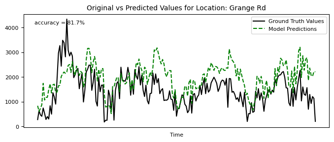
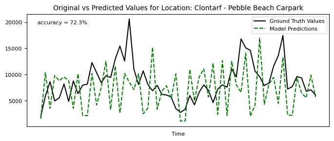

# Strava-Cycling-Modeling-for-Dublin

## The Author

[Chris Luo](https://chrislu0.wordpress.com/), Data Analyst, Smart Dublin, Dublin City Council

## Introduction
Planning for cycling infrastructure can be challenging because there's often a lack of detailed information on where and when people are biking. With the rise of crowdsourced data from platforms like Strava, cities now have the opportunity to gain insights beyond what traditional bike counters, such as the Eco-Counts used in Dublin, can provide. 

However, crowdsourced data doesn't fully represent the entire cycling population, which means there is still much we don't know about cycling trips. Without this knowledge, planning for cycling infrastructure can feel like working with one hand tied behind your back.

My project aims to fill this gap by comparing several years of Strava data with manual counts of cyclists in the context of Dublin. The idea is to use Strava to map all bicyclists by finding out by how much Strava data is representing official counts. I use regression techniques to create a model that uses Strava data to predict overall cycling volumes in Dublin at a route-based level. This is the first practice of its kind to analyze Dublin cycling trips in this way. The results show a strong correlation between Strava data and Cyclecounts in Dublin, indicating that Strava can be a good predictor of actual cycling figures at the route specific level. 

In this document I will introduce the model, datasource, and results. I will also use ground truth data (cycle counts/mannual counts) to validate my model predictions. 

## Strava Metro

Strava is an American app for tracking physical exercise, primarily focusing on outdoor cycling and running activities using GPS data. As of 2023, Strava has 120 million registered users worldwide, according to [Business of Apps](https://www.businessofapps.com/data/strava-statistics/). 

[Strava Metro](https://metro.strava.com/) is Strava's official data platform. It contains downloadable anonymized Strava user geo-referenced and time-stamped activity data(including cycling, running and walking). The data from the platform provides excellent granularity, offering high-resolution time dimensions that can be as specific as hours and a wide coverage of areas that covers almost every streets in Dublin.

Strava Metro acts as a great example of how companies can present user-generated data on an open and intuitive platform that enables researchers and decision-makers to have access to large amounts of high-quality activity data to put into valuable use cases.

## The Model and Data

To gain insights into where and when people are biking, one approach is to install more cycle counters on streets of interest in Dublin. However, this method presents several challenges: (1) it is too costly if a large amount of information is required, and (2) it can be difficult to find available and safe locations for additional cycle counters. So, is there another way to estimate the exact number of cyclists?

An important observation might answer this question. The observation is the high correlation between Strava data and cycle count data captured by cycle counters installed in Dublin. For example, below is a time-series line chart that compares both datasets for Seapoint, Dublin:

### Chart 1: Cycle Counter vs. Strava Trip Counts Over Time in Seapoint (2021-2023, Weekly Summed)

The graph shows a high correlation between the two datasets (0.92) for Seapoint. From the graph it's also evident that the Strava data reflects the overall trends and seasonal changes of the ground truth value. It is evident that Strava data represents only a subset of the total cyclists at this location. But this observation led to the idea of using Strava data to estimate cycle counts based on their correlation because the high correlation is suggesting that Strava can be a good predictor of actual cycling figures at the route specific level. 

The core question to answer then becomes: **by how much Strava cycling trip count data is representing the whole cycling population in Dublin?**

To answer this question we develop a regression model that connects Strava cycling counts and actual cycle counts. After obtaining the relationsship, we can then use it as a multiplier to extrapolate the actual cycling trips based on the widely available and highly granular Strava data. 

Thus we set the main independent variable as Strava cycling trip counts and the dependent variable of interest as the cycle counts, which are the ground truth (correct) target values.

Cycle count data is sourced from data generated by cycle counters (EcoCounters) in various locations in Dublin. The data is available on [Dublinked](https://data.smartdublin.ie/dataset/?q=Cycle+count).

Strava cycling trip counts are downloaded from Strava Metro and matched with cycle counter locations.

There are also other factors that is related the Strava data's representation of the whole cycling crowd since these factors can influence cycling behaviors. Therefore, the model includes additional factors as control variables to account for these influences. Below is a list of variables and their data sources:

### Table A: List of Control Variables

| Variables                          | Description                                                      |
|------------------------------------|------------------------------------------------------------------|
| $\text{Rain}$                      | Rainfall, sourced from Met.ie                                    |
| $\text{Regions: S, SE, N, NE}$     | Geolocation of the point of interest: South, North, Northeast, Southwest |
| $\text{Months}$                    | Months: January to December                                      |
| $\text{CityCenter}$                | Whether the location is in the city center (defined by the canal) |
| $\text{Bike\_Lanes}$               | Whether the location has bike lane availability                  |

The model is a multiple linear regression model using Weighted Least Squares (WLS) regression. Compared to the more common Ordinary Least Squares (OLS), WLS minimizes heteroskedesticity (that is the variance is not uniform across the observed data).

The model is given by:

$$
\text{cycle\_counts} = \beta_0 + \beta_1 \cdot \text{strava\_counts} + \beta_i \cdot \text{controls} + \varepsilon
$$

Where:
- $\text{cycle\_counts}$ is the dependent variable, the ground truth cycle count data.
- $\beta_0$ is the intercept.
- $\beta_i$ are the coefficients for each independent variable.
- $\text{controls}$ are the control variables, which include the variables in **Table A**.
- $\text{strava\_counts}$ are the independent variables, the trip counts from Strava.
- $\varepsilon$ is the error term.

The descriptive statistics in Table B summarize the data across three key variables: Actual cycle counts(cycle_counts), Strava cycle counts(strava_counts), and amount of rainfall(Rain). All the data are weekly aggregated. The dataset has 2,657 observations, that is the number of observations after removing missing values. The average actual cycle count is 5,449.55 with a high standard deviation of 5,303.81, indicating significant variability.  Strava cycle count has a mean of 439.16 and an even higher standard deviation of 547.53, showing a broad range of Strava activity level across different time and location. The weekly rainfall average is 13.87 mm. 

### Table B: Descriptive Statistics

Descriptive Statistics:
     cycle_counts  strava_counts        rain   Bike_Lanes
count   2650.000000       2650.000000  2650.000000  2650.000000
mean    5440.266119        439.569811    13.903321     0.971321
std     5297.740803        547.637901    15.153541     0.166935
min        1.000000          5.000000     0.000000     0.000000
25%     1053.250000         55.000000     2.100000     1.000000
50%     3449.000000        190.000000     8.300000     1.000000
75%     8452.250000        655.000000    19.200000     1.000000
max    26468.000000       3590.000000    73.400000     1.000000

The figure below visualizes the locations of existing cycle counters in Dublin. The map highlights that all cycle counters are located within DCC and DLR, with the majority of them positioned outside the city center, indicating a bias in the representation of locations in the sample data. 

### Figure 1: Location of existing cyclecounters

## Results and model performance
After running the Weighted Least Squares (WLS) regression in Python, the results are summarized below:

### Table C: WLS Regression Results

## WLS Training Summary

### WLS Regression Results

| **Variable**         | **coef**       | **std err** | **t**      | **P** | **[0.025**     | **0.975]**    |
|:-----------------|:-----------|:--------|:--------|:------|:----------|:----------|
| constant            | -5934.4661 | 273.398 | -21.706 | 0.000 | -6470.563 | -5398.369 |
| Strava_count | 6.1157    | 0.052   | 118.129 | 0.000 | 6.014     | 6.217     |
| rain             | -13.3057  | 1.384   | -9.614  | 0.000 | -16.019   | -10.592   |
| Area_CC          | 1.541e+04 | 116.661 | 132.058 | 0.000 | 1.52e+04  | 1.56e+04  |
| Area_N           | -401.7894 | 177.380 | -2.265  | 0.024 | -749.608  | -53.971   |
| Area_SE          | -85.1842  | 53.932  | -1.579  | 0.114 | -190.938  | 20.569    |
| Area_NE          | -214.2369 | 97.044  | -2.208  | 0.027 | -404.528  | -23.946   |
| Bike_Lanes       | 6710.9627 | 263.229 | 25.495  | 0.000 | 6194.805  | 7227.120  |
| month_2          | 858.6988  | 93.081  | 9.225   | 0.000 | 676.179   | 1041.219  |
| month_3          | 779.0489  | 79.965  | 9.742   | 0.000 | 622.248   | 935.849   |
| month_4          | 520.0684  | 94.947  | 5.477   | 0.000 | 333.891   | 706.246   |
| month_5          | 810.8211  | 92.599  | 8.756   | 0.000 | 629.247   | 992.395   |
| month_6          | 1369.9557 | 98.532  | 13.904  | 0.000 | 1176.748  | 1563.163  |
| month_7          | 1251.0766 | 90.919  | 13.760  | 0.000 | 1072.796  | 1429.357  |
| month_8          | 1194.2051 | 95.440  | 12.513  | 0.000 | 1007.059  | 1381.351  |
| month_9          | 1905.4191 | 95.140  | 20.027  | 0.000 | 1718.862  | 2091.977  |
| month_10         | 1683.6207 | 84.458  | 19.934  | 0.000 | 1518.010  | 1849.231  |
| month_11         | 1182.7234 | 106.593 | 11.096  | 0.000 | 973.709   | 1391.738  |
| month_12         | 493.7711  | 89.968  | 5.488   | 0.000 | 317.355   | 670.187   |

### Note
- **WLS Accuracy:** 80.35%
- **Unweighted R-squared (WLS)** 0.9034
- **Validation RMSE (WLS):** 2148.0559
- **Test RMSE (WLS):** 2538.4753
- **Test MAE (WLS):** 1648.7908

For full documentation of the modeling process, see here: (coming soon!)

### Performance Interpretation

This is a weekly model, which means it uses weekly Strava trip counts to infer the weekly cycle counts.

Explained variation (R²) is the most common performance measure for continuous outcomes. An R-squared score of 0.9034 indicates that 90.3% of the data is explained by the model. The accuracy score reflects the prediction ability of the model. An accuracy of 80.35% indicates that the predicted cycling trip volume is 80.35% correct against the actual cycling trip volume, under a train/test split machine-learning practice.

Below is a visualization of how the model fits the values:

### Chart 2: Actual vs. Predicted Values

## Data Insights

- **Strava Trip Count**: The coefficient for Strava trip count is 5.3782, implying that, holding other factors constant, a one-unit increase in weekly Strava trips is associated with an increase of 5.3782 in total cycling trips.
- **Rain**: The coefficient for rain is -14.6000, indicating that rainy weather reduces cycling trips by approximately 14.6 units per unit of rain.
- **Seasonal Variations**: The coefficients for the summer months (e.g., June, July, August) are significantly positive, indicating higher cycling activity during these months. For example, the coefficient for June is 1612.8795, showing a substantial increase in cycling trips during this month.

### Unexpected Findings
- **Off-Street Paths and Bike Lanes**: Both Off-Street Paths (-7161.1806) and Bike Lanes (-6037.6537) have negative coefficients, which is counterintuitive. This may suggest model adjustments or sampling issues. Further investigation is required to understand these results better.

## Validation

We validated the model predictions against actual cycling volumes for several locations, with the y-axis representing weekly values over the period 2021-2023.

For many locations, the model's predictions closely match the actual cycling volumes recorded by cycle counters. For example:

### Chat 3: Original vs Predicted Values (Seapoint)

### Chat 4: Original vs Predicted Values (N11 Inbound)

### Chat 5: Original vs Predicted Values (Grange Road)

However, the model's accuracy decreased in locations closer to . For instance, the prediction was less accurate for Clontarf:
### Chat 6: Original vs Predicted Values (Clontarf - Pebble Beach Carpark)

### Chat 6: Original vs Predicted Values (Richmond Rd Upper)

We also validated the model against manual count data for two city center locations—Amien Street and IFSC, which are not included in the traning data. Those mannual count are from Dublin City Council official traffic counts. The table below summarizes the comparison:

### Table E: Validation With Mannual Counts (Amien St & IFSC)
| **Time & Location**       | **Strava Count** | **Manual Count** | **Predicted Value** | **Difference** |
|--------------------|------------------|------------------|---------------------|----------------|
| *2024 May 13-19*     |                  |                  |                     |                |
| **Amien St**       | 600              | 14,342           | 12,486           | -13%           |
| **IFSC**           | 615              | 13,126           | 12,566           | -4%            |

The validation also showed high validity of the model.

In summary, the validation showed mixed results for the model's performance. It works better for non-city center areas(e.g. Seaepoint) and is less accurate for locations close to the city center(e.g. Richmond Rd). Therefore, I believe the model is best suited for route-based analysis—aggregating predictions across entire cycling routes can yield more accurate results since the combined results may weight out the prediction errors. However, it's important to note that there's currently no method to validate route-based analysis, as data on cycling trips for entire routes is unavailable.

Despite the variations in volume accuracy, the model effectively captures trends and seasonal changes in cycling numbers, providing valuable insights into cycling behavior.

## Use of the Model

To use this model, follow these steps:

1. Prepare Data: Collect and prepare the data, including combined Strava trip counts and control variables.
2. Apply Coefficients: Multiply each variable by its respective model coefficient.
3. Sum Results: Sum the results to estimate the total cycle counts.

### Example Calculation

To estimate the cycle counts for a week with the following conditions:

- **Strava trip count**: 100
- **Rain**: 2 units
- **Location**: North
- **Month**: June
- **Bike Lanes**: Yes (value = 1)

The calculation follows this formula:

$$
\text{Cycle\_counts} = 
\text{constant} + (\text{Strava\_trip\_count} \times \text{Coefficient}) + (\text{rain} \times \text{Coefficient}) + 
$$
$$
(\text{Area\_N} \times \text{Coefficient}) + (\text{month\_6} \times \text{Coefficient}) + 
(\text{Bike\_Lanes} \times \text{Coefficient})
$$

Substituting the specific coefficients from the model:

$$
\text{Cycle\_counts} = 
-5934.4661 + (100 \times 6.1157) + (2 \times -13.3057) + 
(-401.7894) + (1369.9557) + (1 \times 6710.9627)
$$

$$
\text{Cycle\_counts} = -5934.4661 + 611.57 - 26.6114 - 401.7894 + 1369.9557 + 6710.9627
$$

$$
\text{Cycle\_counts} = 2329.6215
$$

So, under these specific conditions, the estimated weekly cycle count is **2330**.

I have also interpolated the cycling trip values for several key cycleroutes in Dublin (Weekly figure). I have included the raw data in the Appendix. Below is a quick view of the results:
### Chart 7: Visualisation of Predicted Weekly Cycling Trips for Various Routes:

## Shortcomings and Future Improvements

While the model shows a good predictive ability overall, several areas for improvement have been identified:

1. **Counter Location Bias**: The existing cycling counters in Dublin are predominantly located within the Dublin City Council (DCC) and Dún Laoghaire-Rathdown (DLR) areas. There is a lack of representation in peripheral areas such as the South Dublin and Fingal. Additionally there's a lack of counters at the city center (See **Figure 1**). This geographical limitation could lead to biased predictions, as the model does not fully capture cycling behavior across different types of streets and environments. This can be improved by locating cyclecounters at more diversed locations.

2. **Construction Impact**: Ongoing cycle route constructions may influence cycling activity, but this factor is not currently integrated into the model. This could result in discrepancies between predicted and actual cycling counts, especially in areas undergoing significant infrastructure changes, like the [C2CC project](https://www.dublincity.ie/residential/transportation/active-travel/projects/clontarf-city-centre-project).

3. **Strava Data Precision**: The Strava data used in the model has been anonymized by rounding trip counts to the nearest multiple of five(i.e. 5,10,15,20...). This lack of granularity can introduce inaccuracies, particularly in areas with lower cycling volumes, where small changes in actual counts might lead to more significant deviations in predictions.

4. **Model Limitations**: The negative coefficients for Off-Street Paths and Bike Lanes, which are counterintuitive, suggest potential issues with the model specification. These findings may indicate that additional variables or a different modeling approach, such as non-linear models or interaction terms, might better capture the complex relationships between cycling activity and infrastructure.

## Conclusion & key takeaways

1. In this report, I introduced a weekly prediction model for cycling volumes using Strava Metro data and other open sourced data.
2. The model demonstrates relatively high accuracy in predicting cycling volumes. However, due to data limitations, the model performs better for locations outside of the city center or when analyzing combined routes. It is less accurate for individual locations within the city center, making it best suited for route-based analysis.
3. This model can significantly empower those interested in understanding how many people are biking on specific routes during particular time periods in Dublin.
4. The model also effectively captures seasonal trends and variations in cycling activity, offering valuable insights into how cycling patterns change over time.
5. With further improvement and additional data sources, the model has the potential to support urban planning and infrastructure development by providing detailed insights into cycling behavior across the city.

## Appendix 1: Extrapolated cycling volume for cycle routes.
